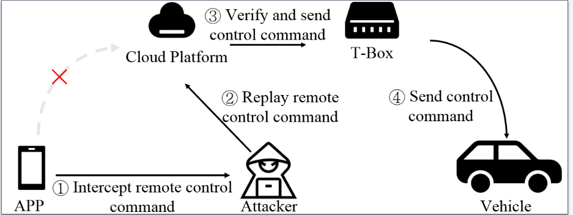
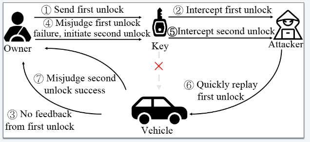

# Study of attack surfaces

Based on the classification of ICV vulnerabilities by location and type, this section studies the main attack surfaces of ICV vulnerabilities.
We divide exploits reported by competitors into remote attacks, mid-range attacks, and short-range attacks according to the approximate distance required between the attacker and the vehicle. 

## Remote attack surface

Fig 1: A typical remote ICV attack surface.

Fig.1 illustrates a typical remote ICV vulnerability exploit reported by competitors. Vehicle owners typically send remote control commands via an APP, such as pre-activating the air conditioning. However, an attacker may intercept the APP’s operation, obtain vehicle control commands (①), and replay them at an opportune moment (②). The cloud platform verifies the received command and sends a control instruction to the T-Box (③), which then transmits the command to the corresponding ECU for execution (④). Without proper verification and encrypted transmission, remote attacks can occur through multiple pathways. For instance, an attacker may access the cloud platform via a web browser to remotely control the vehicle or steal private data. Given the critical role of the cloud platform, manufacturers should enhance security measures and refine authorization mechanisms to effectively prevent remote attacks.

## Mid-range attack surface

Fig 2: A typical mid-range ICV attack surface..

Unauthorized unlocking by relaying/replaying the radio key fob unlock signal is a typical mid-range attack surface. Fig.2 illustrates a common mid-range ICV attack surface reported by competitors. Normally, the owner can send a signal to unlock the vehicle (①). Howerver, an attacker equipped with specialized equipment like high-gain antennas and Software-Defined Radios[1] can intercept the vehicle's unlock signal from several meters away[2, 3], causing the vehicle to provide no feedback (③). Then the owner might mistakenly judge that the first unlock signal was not sent successfully and then send a second unlock signal (④). At this point, the attacker can once again intercept the second unlock signal (⑤) and quickly replay the first unlock signal (⑥), resulting in the vehicle unlocking successfully. Meanwhile, the owner might mistakenly assume that the second unlock was successful (⑦), unaware that the attacker has stored the second unlock signal for future potential unauthorized unlocks.
It can be seen that, under mid-range attack scenarios, adding a validity period check to the unlock signal can effectively prevent such replay attacks.

## Short-range attack surface

Attacks on IVI, T-Box, and network modules are typically classified as short-range attacks. Similar to tablets and smartphones, the attack surface of IVI and T-Box are very similar to traditional mobile OS. The main attack surfaces involve scanning entry points, such as open network ports and debug interface, for penetration testing to gain access to the IVI and T-Box systems. Therefore, for short-range attacks, protecting open ports and interfaces, as well as timely updating of software, are effective preventative measures.

[1] Software-defined Radios: Architecture, state-of-the-art, and challenges. Computer Communications 2018

[2] RollBack: A New Time-Agnostic Replay Attack Against the Automotive Remote Keyless Entry Systems. ACM Trans. Cyber-Phys. Syst. 2024

[3] Breaking BLE Beacons For Fun But Mostly Profit. EuroSec 2017