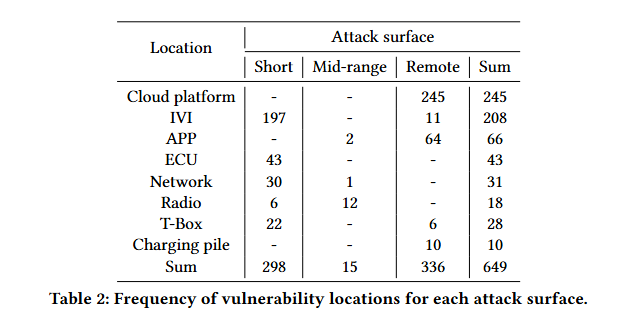

# Introduction

In the ICV_study.* files within this directory, an additional column named "attack surface" has been added to the existing tables. Based on this "attack surface" column, the following two dimensions have been compared:

- Vulnerability types and attack surface
- Vulnerability locations and attack surface

### Vulnerability types and attack surface

According to the data in Table 1, regarding vulnerability types:

- Authentication vulnerabilities, such as unauthorized accessing and identity spoofing, along with
  information leakage and injection vulnerabilities like SQL injection and command injection, are
  predominantly concentrated on the remote attack surface.
- OS-related vulnerabilities, including kernel issues and arbitrary software installation, as well as DoS
  attacks, are primarily focused on the short-range attack surface.
- File operation vulnerabilities, which encompass file accessing, downloading, tampering, uploading,
  traversal, and deletion, are more evenly distributed between the short and remote attack surfaces.
- Interception vulnerabilities, such as relay, replay, and man-in-the-middle attacks, are balanced between
  the short and mid-range attack surfaces, with mid-range vulnerabilities being exclusive to the interception type.

From the data presented, we can derive the following insights:

1. **Boost Remote Security:** The high number of authentication and injection flaws in remote attacks calls for stronger security protocols. Researchers should focus on better authentication and input validation to defend against these threats.
2. **Fortify OS and Kernel:** The concentration of OS vulnerabilities in short-range attacks shows a need to improve operating system and kernel security. Efforts should aim at developing more secure kernel architectures and software installation processes.
3. **Safeguard File Operations:** With file operation vulnerabilities spread across attack surfaces, securing file handling is crucial. This includes tight access controls, integrity checks, and secure download or deletion to prevent unauthorized access and breaches.

### Vulnerability locations and attack surface

According to the data presented in Table 2, the attack surfaces are categorized into short-range, mid-range, and remote attacks, with totals of 298, 15, and 336 respectively:

- The 298 short-range attacks are predominantly found in in-vehicle components, including IVI (In-Vehicle Infotainment) with 197 instances, ECU (Electronic Control Unit) with 43 instances, and T-Box with 22 instances.
- The 15 mid-range attacks are primarily directed towards the radio, with 12 instances reported.
- The 336 remote attacks are largely concentrated in the cloud platform, accounting for 245 instances, and the APP (Application), with 64 instances.

Here are three insights gleaned from Table 2:

1. **In-Vehicle Components are High-Risk for Short-Range Attacks:** The majority of short-range vulnerabilities are associated with in-vehicle systems like IVI, ECU, and T-Box. This suggests a need for enhanced security measures within vehicle electronics to mitigate the risk of local attacks.
2. **Radio Systems are Vulnerable to Mid-Range Threats:** With all mid-range attacks targeting the radio, it indicates that radio systems may have specific vulnerabilities that need to be addressed to prevent potential mid-range security breaches.
3. **Cloud and APP Platforms are Prime Targets for Remote Attacks:** The high number of remote attacks on cloud platforms and applications indicates that these areas are critical targets for cyber threats. Strengthening security protocols for cloud services and mobile applications should be a priority to protect against remote exploitation.

