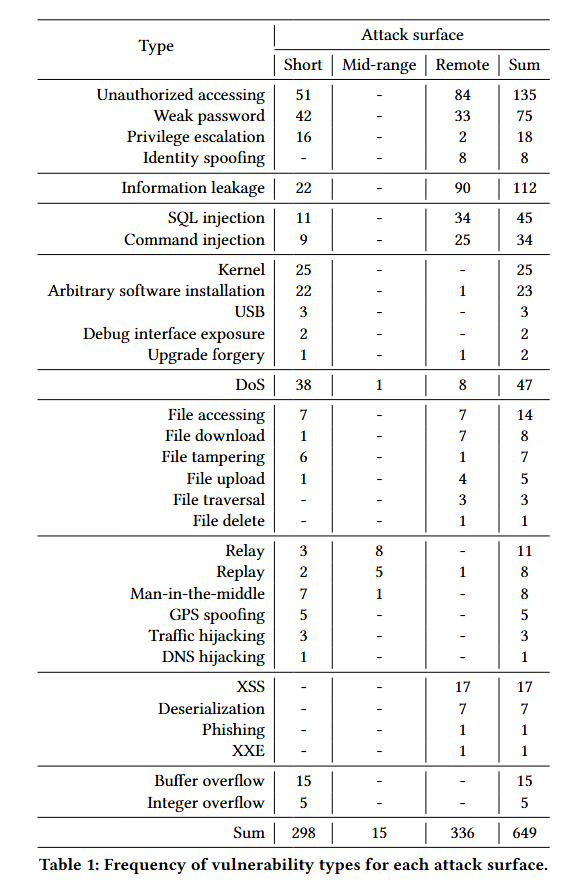

# Introduction

In the ICV_study.* files within this directory, an additional column named "attack surface" has been added to the existing tables. Based on this "attack surface" column, the following two dimensions have been compared:

- Vulnerability types and attack surface
- Vulnerability locations and attack surface

### Vulnerability types and attack surface

In terms of vulnerability types, authentication vulnerabilities, information leakage, and injection vulnerabilities are predominantly focused on the remote attack surface. OS, DoS, and memory vulnerabilities are concentrated on the short-range attack surface. File operation vulnerabilities are more evenly distributed between short and remote attack surfaces. Interception vulnerabilities are balanced between short and mid-range attack surfaces, but only the interception type includes medium-range vulnerabilities.

### Vulnerability locations and attack surface

​	On the attack surface, there are a total of 298 short-range, 15 mid-range, and 336 remote attacks. The 298 short-range attacks are concentrated in in-vehicle components such as IVI (In-Vehicle Infotainment), ECU (Electronic Control Unit), and T-box; the 15 mid-range attacks are focused on the radio; and the 336 remote attacks are centered on the cloud platform and APP (Application).
