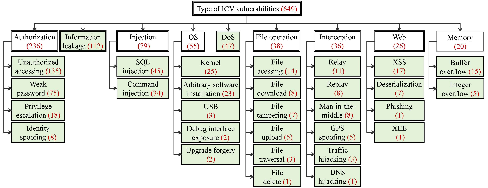

# Type Taxonomy

To develop targeted detection techniques and address the diverse security challenges in ICVs, we classify vulnerabilities by type. As illustrated in the figure above, this taxonomy comprises 9 main categories, such as Authorization, Information Leakage, etc. These main types can be further subdivided into 31 leaf categories, such as Unauthorized Accessing, Weak Password, and SQL Injection. Additionally, Table [tab:matrix] demonstrates the frequency of these types across vulnerability locations, revealing clear correlations between specific vulnerability types and their associated locations, such as the prevalence of Weak Password in network systems. This classification enables precise identification of vulnerability patterns, supporting the development of tailored detection strategies.

## Authorization

The most prevalent types of ICV vulnerabilities is authorization, accounting for 36.4% of all vulnerabilities, including *unauthorized accessing*, *weak password*, *privilege escalation*, and *identity spoofing*.

- **Unauthorized accessing.** The *unauthorized accessing* category accounts for 57.2% of the authorization vulnerabilities. When components of ICVs, such as cloud platforms, APP, IVI, etc., have vulnerabilities in their user authentication processes, unauthorized attackers may be able to perform actions that would normally be prohibited. This could lead to risks such as privacy data breaches and remote hijacking of the vehicle. For example, an unauthorized attacker could access a large amount of personal user information stored on the cloud platform, leading to privacy data breach.

- **Weak password.** The *weak password* vulnerabilities account for 31.8% of all authorization vulnerabilities. We have observed a large number of weak password vulnerabilities in many components of ICVs, such as cloud platform, IVI, and network. Developers often use empty passwords, weak passwords, or hardcoded passwords for authentication, making it easy for attackers to brute-force these credentials. These vulnerabilities reflect a current trend of negligence towards the security in the ICV industry.

- **Privilege escalation.** In the in-vehicle components, specifically in IVI, T-Box, and network, we observed 18 instances of *privilege escalation* vulnerabilities. These vulnerabilities are mainly concentrated in IVI systems, where attackers can exploit them to escalate from regular user privileges to root privileges, thereby gaining higher execution permissions, such as the ability to install arbitrary applications onto the IVI system.

- **Identity spoofing.** In the outside-vehicle components, primarily in cloud platform and APP, we observed 8 instances of *identity spoofing* vulnerabilities. This type of vulnerabilities are a result of unclear definitions in the authorization categories for ICVs, which can lead to confusion in access control. For example, an attacker could exploit a regular vehicle owner's privileges and use identity spoofing to masquerade as a higher-privileged user, such as a sales representative.

## Information Leakage

The *information leakage* vulnerabilities account for 17.3% of the total vulnerabilities. They are primarily found in outside-vehicle components, including cloud platform and mobile APP, where sensitive information such as VIN, passwords, and keys is exposed due to implementation errors. This type of vulnerability can further lead to other security issues, such as ransomware.

## Injection

The injection type of vulnerabilities account for 12.2% of the total vulnerabilities, and are divided into two types: *SQL injection* and *command injection*.

- **SQL injection.** The *SQL injection* vulnerabilities account for 57.0% of all injection vulnerabilities, primarily occurring in cloud platform and IVI components. These components fail to adequately validate inputs when executing SQL queries, allowing attackers to inject malicious code that gets erroneously executed. Such vulnerabilities lead to the privacy data breach from the database.

- **Command injection.** The *command injection* vulnerabilities account for 43.0% of all injection vulnerabilities, occurring in many components such as cloud platform, mobile APP, and T-Box. These vulnerabilities stem from inadequate validation of external inputs, enabling malicious commands injected by attackers to be improperly executed. The consequences of such vulnerabilities can vary depending on the component where they occur, potentially leading to the privacy data breach, control hijacking, or ransomware.

## OS

The *OS* vulnerabilities account for 8.5% of the total vulnerabilities and are divided into five types: *kernel*, *arbitrary software installation*, *USB*, *debug interface exposure*, and *upgrade forgery*.

- **Kernel.** The *kernel* vulnerabilities account for 45.5% of *OS* vulnerabilities, all of which occur within IVI components. The root cause of these vulnerabilities is closely tied to the IVI supply chain security. Specifically, vulnerabilities within the underlying Linux or browser kernels of IVI systems lead to the propagation of vulnerabilities in IVI systems utilizing these kernels. The consequences of such vulnerabilities are severe, potentially resulting in privacy data breach and vehicle control hijacking.

- **Arbitrary software installation.** The *arbitrary software installation* vulnerabilities account for 41.8% of all *OS* vulnerabilities, primarily occurring in IVI components. These vulnerabilities arise because the operating system lacks proper security checks for third-party application installation. Attackers may install viruses, trojans, or backdoor software to monitor the owner's privacy over the long term.

- **USB.** There are 3 instances of *USB* vulnerabilities, all occurring in IVI module. These vulnerabilities stem from the lack of security restrictions on the USB interface within the IVI system. As a result, attackers can exploit the USB interface to gain control over the vehicle's IVI system, such as unlocking the trunk, leading to privacy data breach or control hijacking.

- **Debug interface exposure.** There are 2 instances of *debug interface exposure* vulnerabilities, occurring in IVI and network. These vulnerabilities arise when developers fail to disable debug interfaces after testing, leaving them exposed. Attackers can exploit these exposed interfaces to simulate developer control over the vehicle, leading to potential privacy data breach or vehicle control hijacking.

- **Upgrade forgery.** There are 2 instances of *upgrade forgery* vulnerabilities, occurring in ECU and T-Box components. These vulnerabilities arise because the components do not properly check the received upgrade packages. As a result, malicious upgrade packages can downgrade the component to an insecure version, allowing attackers to exploit the vulnerabilities in the outdated version to gain control over the vehicle, leading to vehicle control hijacking.

## DoS

The *DoS* vulnerabilities account for 7.2% of the total vulnerabilities, with a total of 47 instances. These vulnerabilities are primarily found in IVI systems, where they occurred 26 times, representing 55.3% of the cases. The root causes of these *DoS* vulnerabilities include component configuration errors, kernel flaws, and logical design weaknesses. Such vulnerabilities can lead to system damage in the affected components within the vehicle.

## File Operation

Thank you for raising this question. Although file accessing, downloading, and traversal are all file-related vulnerabilities, they are distinct concepts. Specifically, file accessing vulnerabilities arise from insecure configurations, enabling attackers to access sensitive files directly. File download vulnerabilities occur due to insufficient access controls, allowing attackers to download files they shouldn't. File traversal is about exploiting inadequate path filtering to navigate to unauthorized directories. While they can all lead to data breaches, they involve different attack vectors and require different security measures.

The file operation type of vulnerabilities account for 5.9% of the total vulnerabilities, with a total of 38 instances. These vulnerabilities are divided into six types: *file accessing*, *file download*, *file tampering*, *file upload*, *file traversal*, and *file delete*.

- **File accessing.** The *file accessing* vulnerabilities account for 36.8% of all file operation vulnerabilities, occurring in cloud platform and IVI components. These vulnerabilities arise from insecure file partition management configurations on cloud platforms or arbitrary file reading vulnerabilities in the browser on the IVI system. Attackers can access sensitive files, leading to privacy data breach.

- **File download.** The *file download* vulnerabilities account for 21.1% of all file operation vulnerabilities, primarily occurring in cloud platform. These vulnerabilities arise from insufficient access controls within the cloud platform, which allows attackers to download files that should otherwise be protected, leading to the privacy data breach.

- **File tampering.** The *file tampering* vulnerabilities account for 18.4% of all file operation vulnerabilities, primarily occurring in IVI systems. As IVI systems store data such as vehicle speed and fuel level as system files, improper configuration of file modification permissions can allow attackers to tamper with or delete these files. This may result in incorrect data being displayed on the main screen, and if a DoS attack is triggered, it could lead to privacy data breaches or even vehicle control hijacking.

- **File upload.** There are 5 instances of *file upload* vulnerabilities, primarily occurring in cloud platform. These vulnerabilities arise because the components provide an interface for users to upload content without properly checking the uploaded files. Attackers can exploit this by uploading arbitrary files, leading to vehicle privacy information breach and potential ransomware attacks.

- **File traversal.** There are 3 instances of *file traversal* vulnerabilities, all occurring in cloud platform. These vulnerabilities arise from inadequate path filtering within the platform, which allows attackers to exploit these flaws to perform directory traversal scans on vulnerable directories. This can lead to the privacy data breach.

- **File delete.** There is 1 instance of *file delete* vulnerability, occurring in cloud platform. The root cause is the cloud platform's failure to properly validate user permissions, allowing attackers to delete arbitrary files, causing severe damage to platform services.

## Interception

The interception type of vulnerabilities account for 5.6% of the total vulnerabilities, with a total of 36 instances. These vulnerabilities are divided into six types: *relay*, *replay*, *man-in-the-middle*, *GPS spoofing*, *traffic hijacking*, and *DNS hijacking*.

- **Relay.** The *relay* vulnerabilities account for 30.6% of the interception vulnerabilities, primarily occurring in radio. The root cause of these vulnerabilities lies in the system's failure to adequately encrypt or authenticate the transmitted information. This vulnerability allows attackers to exploit "relay" communication, enabling them to perform unauthorized actions. Consequently, this could lead to the unauthorized unlocking of the vehicle, posing significant security risks.

- **Replay.** The *replay* vulnerabilities account for 22.2% of the interception vulnerabilities, primarily occurring in radio. These vulnerabilities arise from the components' failure to effectively recognize and prevent the re-transmission of previously transmitted data packets. As a result, attackers can exploit intercepted data to carry out replay attacks, leading to unauthorized unlocking of the vehicle.

- **Man-in-the-middle.** The *man-in-the-middle* vulnerabilities account for 22.2% of the interception vulnerabilities, primarily occurring in IVI. The root cause of these vulnerabilities is the components' failure to ensure a secure connection between the communicating parties. This allows attackers to intercept, modify, and forward communication data without being detected by either party, leading to the potential privacy data breach or control hijacking of the vehicle.

- **GPS spoofing.** The *GPS spoofing* vulnerabilities account for 13.9% of the interception vulnerabilities, all occurring in ECU. The root cause of these vulnerabilities lies in the weak signal strength of the GPS system. This allows attackers to transmit stronger counterfeit signals to deceive the GPS receiver, leading to inaccurate positioning or receiving incorrect routes. As a result, this can cause system damage or even driving accident.

- **Traffic hijacking.** There are 3 instances of *traffic hijacking* vulnerabilities, primarily occurring in IVI. The root cause of these vulnerabilities lies in the IVI system's failure to use proper encryption protocols, such as TLS, when communicating with external entities. As a result, traffic can be intercepted by attackers, leading to the privacy data breach and the potential control hijacking over the system.

- **DNS hijacking.** There is 1 instance of *DNS hijacking* vulnerability, occurring in IVI. The root cause of this vulnerability lies in the lack of effective security validation and filtering mechanisms in the IVI system’s DNS handling process. This vulnerability allows attackers to exploit DNS hijacking attacks, redirecting application installation requests to malicious servers. As a result, this enables application installation hijacking, which can lead to the privacy data breach and control hijacking of the vehicle system.

## Web

The web-specific vulnerabilities constitute 4.0% of the total, with 26 instances identified. These vulnerabilities are categorized into four types: *XSS*, *deserialization*, *phishing*, and *XEE*. All instances are located within the cloud platform and exhibit the same fundamental principles as web security vulnerabilities typically. Interestingly, the potential impact of these vulnerabilities within the ICV system leads to even more severe consequences.

- **XSS.** The *XSS* vulnerabilities account for 65.4% of the web vulnerabilities, occurring in cloud platform. The root cause of these vulnerabilities lies in the failure of the manufacturers' cloud platform to properly handle user input. This vulnerability allows attackers to inject malicious scripts that can be executed through other users' browsers, leading to the privacy data breach, such as vehicle purchase details and other private data of the car owner.

- **Deserialization.** The *deserialization* vulnerabilities account for 26.9% of the web vulnerabilities, occurring in cloud platform. The root cause of these vulnerabilities lies in the vehicle cloud platform’s failure to adequately validate and filter user-inputted data. This deficiency allows attackers to craft malicious data that triggers deserialization processes, enabling them to execute arbitrary code or inject objects. Such attacks can lead to the privacy data breach or ransomware threats.

- **Phishing.** There is 1 instance of *phishing* vulnerability, occurring in cloud platform. These vulnerabilities primarily arise from the failure of the ICV cloud platform’s server to properly validate incoming redirect URL parameters. As a result, malicious users can craft deceptive URLs that redirect unsuspecting users to malicious websites. Once redirected, users may be tricked into entering their usernames and passwords, leading to privacy data breach.

- **XEE.** There is 1 instance of *XEE* vulnerability, occurring in cloud platform. The root cause of this vulnerability lies in the cloud platform’s XML document parsing, which introduces external entities. Attackers can exploit this vulnerability to read files on the server or execute system commands, leading to the privacy data breach.

## Memory

The memory type of vulnerabilities account for 3.1% of the total vulnerabilities, with a total of 20 instances. These vulnerabilities are divided into two types: *buffer overflow* and *integer overflow*.

- **Buffer overflow.** The *buffer overflow* vulnerabilities account for 75.0% of the memory vulnerabilities, occurring in IVI, ECU, and T-Box components. These vulnerabilities arise from the failure of developers to properly handle user inputs or data during programming. This vulnerability allows attackers to write overflowing data into the program's input buffer, corrupting the memory. As a result, malicious code could be executed, leading to the potential privacy data breach or control hijacking.

- **Integer overflow.** The *integer overflow* vulnerabilities account for 25.0% of the memory vulnerabilities, occurring in IVI and ECU components. The root cause of these vulnerabilities stems from the failure to adequately consider and handle the maximum value limits of data types during the development process. This vehicle results in integer operations exceeding their representational range, triggering overflow vulnerabilities. Such vulnerabilities may compromise memory integrity, potentially leading to the privacy data breach or control hijacking.
